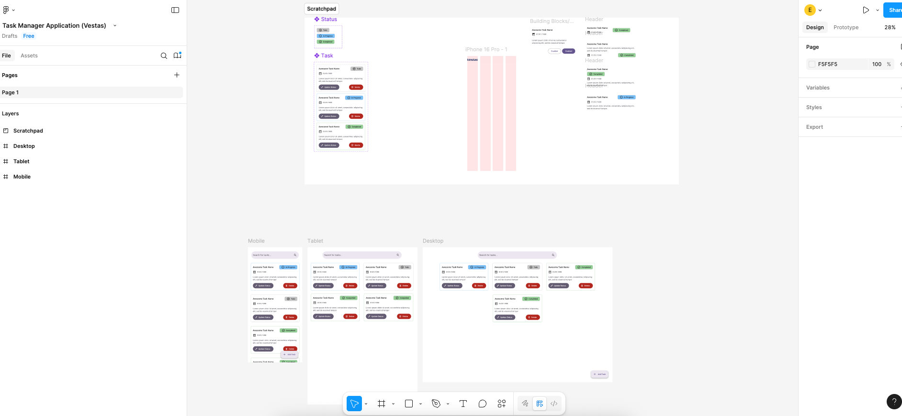

# TaskManager

A simple and modern task management application built with **Angular**, **Angular Material** and **Tailwind CSS**.  
It supports task creation, status updates,task name and description update, search, deletion, and responsive design. Also it is built for a job interview.

## Live preview
https://evicaliskova.github.io/task-manager/

## A few thoughts from me

### Thoughts about the requirements and making assumptions

- **Task creation**  
  Used a dialog with name & description fields. No strict validation was mentioned so it is flexible and simple. I would assume that you need at least a name to create a task. Tasks default to "Todo", with a snackbar confirming success.

- **Task Update**  
  Similar to task creation, I used a dialog for editing. The user can update the name, description.Once updated, a snackbar confirms the change.

- **Task display**  
  Each task shows name, description, status, and creation date. No specific format was mentioned about the date so I used date in user's local format with enough information to be useful (no milliseconds though :D)

- **Status updates**  
  Status progresses in one direction: Todo => In Progress => Completed. I considered letting users go backwards, but stuck to the scope. Updates show feedback via snackbar.

- **Deleting tasks**
  Tasks can be deleted after a confirmation dialog. Requirements didn't mention any archive; once deleted, they’re gone. User is notified via snackbar.

- **Searching**  
  No exact details on kind of search so I used [Fuse.js](https://fusejs.io/) to enable fuzzy search for task name, description, and status. it makes the experience a bit more forgiving 
  For example: searching `update config` still matches `Update backend service config`.

---

### Initial design
Before jumping into development I mocked up a layout in Figma to get a feel for how it could look like on mobile, tablet and desktop. You can check it out [Figma Designs](https://www.figma.com/design/1QE8w4WJvLCI8fPguSO8Lf/Task-Manager-Application--Vestas-?node-id=0-1&t=FGxtYslxqqklXZP3-1)

[](https://www.figma.com/design/1QE8w4WJvLCI8fPguSO8Lf/Task-Manager-Application--Vestas-?node-id=0-1&t=FGxtYslxqqklXZP3-1)

The final version turned out to be slightly different. The is simple, responsive and optimized for mobile, table and descktop screens.

## Tech Stack
- **Figma** - for ui design mocks
- **Angular** – stand-alone components and signals
- **Tailwind css** – styling and responsive layout
- **Angular material** – dialogs, buttons, tooltips, icons.. stuff
- **Fuse.js** – fuzzy search for flexible task filtering
- **Karma/Jasmin** - for unit testing
- **Playwright** – end-to-end testing
- **Docker + nginx** – containarized it - thought I should try it :)
- **Github pages** - hosting sample app

## Architecture Notes

### State Management
- I'm using a root level service to provide and interact witht the task data for components.

### Data Persistence
- On first load, tasks are initialized from a **mock data file**.
- All changes (create, edit, delete, status updates) are saved to **`localStorage`**, simulating persistent storage without requiring a backend.

## Run with Docker

> Requires [Docker](https://www.docker.com/) installed.

### 1. Build the Docker image

```bash
docker build -t task-manager .
```

### 2. Run the container

```bash
docker run -d -p 8080:80 task-manager
```

### 3. Open in your browser

Navigate to http://localhost:8080


## Run Locally (Dev Mode)

Requires Node.js and Angular CLI.

### 1. Install dependencies

```bash
npm install
```

### 2. Start the dev server

```bash
ng serve
```

### 3. Open in your browser

Navigate to http://localhost:4200

## Running Tests

### Run unit tests
```bash
npm run test
```

### Run End-to-End Tests (Playwright)
```bash
npm run e2e
```
